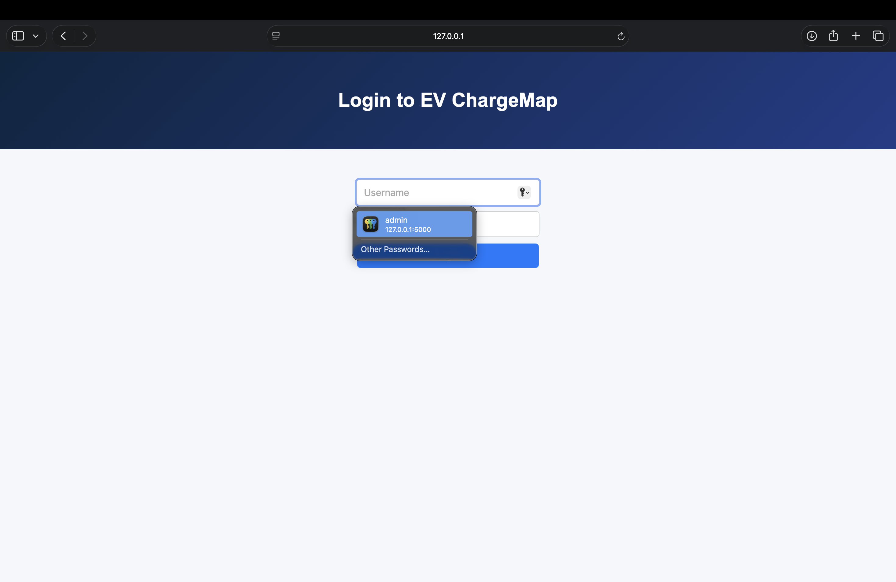
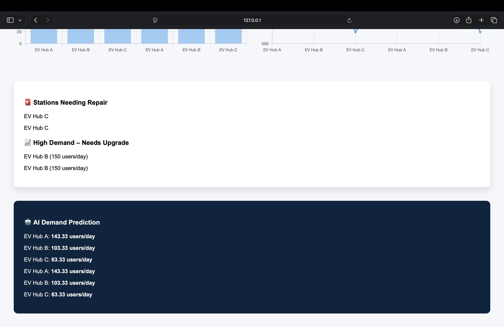

# ⚡ EV ChargeMap – EV Charging Station Tracker

A smart EV Charging Station Tracking System built using **Flask, MySQL, Leaflet, and AI-based demand prediction**.

---

## 🚗 Features

- Live map with EV station markers  
- Driver view for nearby stations  
- Secure login system  
- Admin dashboard with analytics  
- AI-based demand prediction  
- Business insights for expansion  

---

## 🏠 Home Page (Driver View)


---

## 🔐 Login Page



---

## 📊 Admin Dashboard


---

## 📈 Analytics & Insights



---

## 🛠️ Tech Stack

- Frontend: HTML, CSS, JavaScript, Leaflet  
- Backend: Flask (Python)  
- Database: MySQL  
- AI/ML: Scikit-learn  
- Deployment: Localhost  

---

## ▶️ How to Run Locally

```bash
git clone https://github.com/HarshMishra69/EV-ChargeMap.git
cd EV-ChargeMap
pip install -r requirements.txt
python app.py
